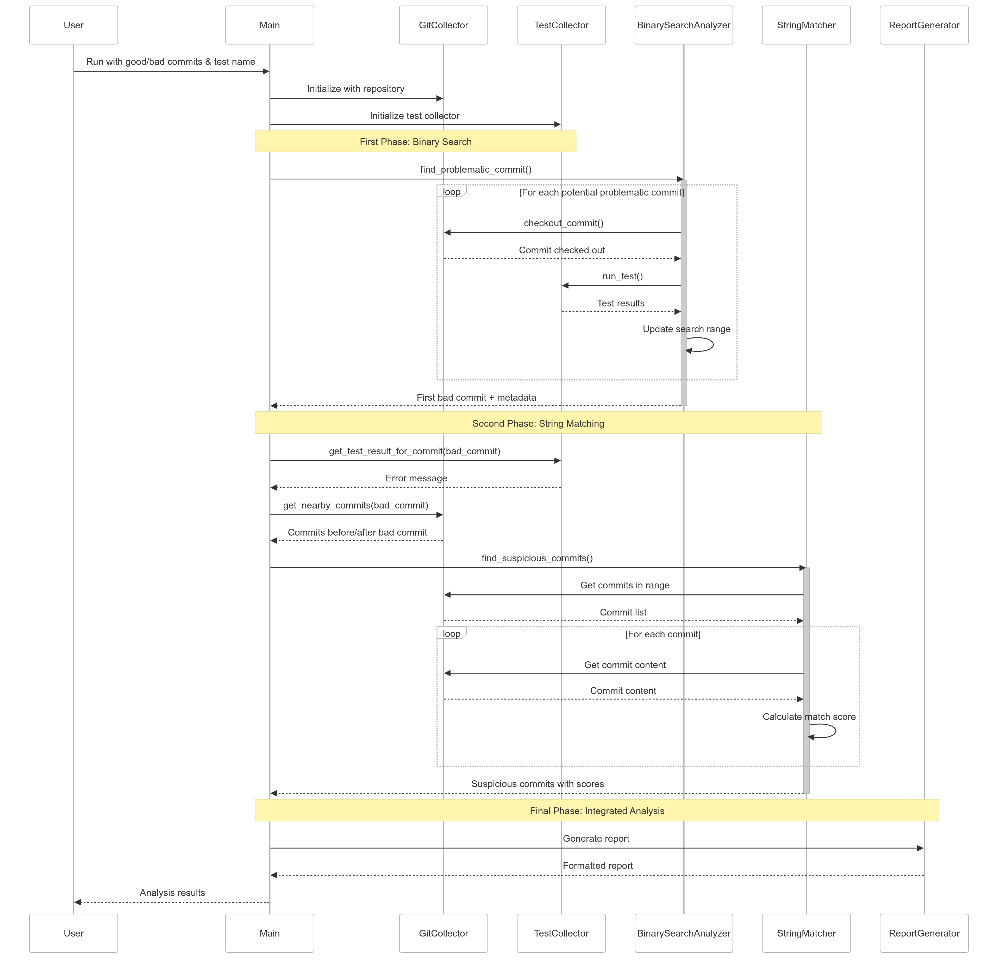

# CommitHunter: AI-Powered Commit Debugger

[](https://www.python.org/downloads/)

CommitHunter is an intelligent tool designed to identify problematic Git commits causing test failures and performance regressions. Using a combination of string matching, binary search, and performance analysis, it helps developers quickly pinpoint the exact commits that introduced issues.

## 🚀 Features

- **Smart Commit Analysis**: Uses AI-powered pattern matching to identify suspicious commits
- **Binary Search**: Efficiently narrows down problematic commits
- **Performance Analysis**: Detects performance regressions and bottlenecks
- **Multiple Report Formats**: Supports JSON, HTML, and text output
- **OpenJ9 Specialized Analysis**: Built-in support for Eclipse OpenJ9 projects
- **Flexible Integration**: Works with various test frameworks and Git repositories

## 📋 Requirements

- Python 3.8 or higher
- Git
- Dependencies listed in `requirements.txt`

## 🛠️ Installation

1. Clone the repository:
```bash
git clone https://github.com/ShantKhatri/CommitHunter
cd CommitHunter
```

2. Set up the environment:
```bash
setup.bat
```

3. Install dependencies:
```bash
pip install -r requirements.txt
```

## 🎯 Usage

### Basic Commands

#### For light run between good and bad commits
```bash
python src\main.py --repo https://github.com/eclipse/openj9 --good "96ef5c5b4026552ec5d6f0413d034cf09ba7103f" --bad "eac681f0cee21af67657f575a366590b937a2a13" --output ./reports/openj9_results.html --report-format html --verbose
```

#### For analysis between two versions (all commits in the last version)
```bash
python src\main.py --repo https://github.com/eclipse/openj9 --good openj9-0.38.0 --bad openj9-0.39.0 --output ./reports/analysis.html --report-format html --verbose
```

#### For OpenJ9 issue analysis with specific test
```bash
python src\main.py --repo https://github.com/eclipse/openj9 --good "good_commit_hash" --bad "bad_commit_hash" --test-name "TestClassName" --output ./reports/test_analysis.html --openj9 --issue 12345
```

### Command Line Options

| Argument         | Description                                                   | Required | Default        | Analysis Impact                                                    |
|------------------|---------------------------------------------------------------|----------|----------------|--------------------------------------------------------------------|
| `--repo`         | URL or local path to the Git repository                       | ✓        | -              | Defines the codebase to analyze                                    |
| `--good`         | Commit hash/tag where tests pass                              | ✓        | -              | Establishes baseline for comparison                                |
| `--bad`          | Commit hash/tag where tests fail                              | ✓        | -              | Identifies the endpoint with issues                                |
| `--output`       | Path to save analysis results                                 | ✗        | stdout         | Controls where results are written                                 |
| `--report-format`| Output format (`html` or `json`)                              | ✗        | html           | Determines report presentation style                               |
| `--test-name`    | Specific test to analyze                                      | ✗        | -              | Enables binary search analysis targeting a specific test failure   |
| `--config`       | Path to configuration file                                    | ✗        | config.yaml    | Allows customization of analyzer thresholds                        |
| `--test-results` | Directory containing test results                             | ✗        | auto-generated | Uses existing test results instead of generating new ones          |
| `--cache-dir`    | Directory for caching Git data                                | ✗        | .cache         | Controls repository caching location                               |
| `--verbose`      | Enable detailed logging                                       | ✗        | false          | Increases logging verbosity for debugging                          |
| `--perf`         | Include performance analysis                                  | ✗        | false          | Adds performance regression detection                              |
| `--perf-only`    | Only run performance analysis                                 | ✗        | false          | Focuses exclusively on performance metrics                         |
| `--classify-only`| Only classify commits                                         | ✗        | false          | Performs basic classification without in-depth analysis            |
| `--openj9`       | Enable OpenJ9-specific analysis                               | ✗        | false          | Activates specialized Eclipse OpenJ9 analysis pipeline             |
| `--issue`        | OpenJ9 issue number                                           | ✗        | -              | Links analysis to specific issue and enables OpenJ9-focused mode   |


## Analysis Types
CommitHunter can run different types of analyses depending on the arguments provided:
#### Basic Analysis
```bash
python src\main.py --repo https://github.com/eclipse/openj9 --good "good_commit_hash" --bad "bad_commit_hash" --output ./reports/analysis.html
```

- Performs string matching to find suspicious commits
- Classifies commits between good and bad as safe or problematic
- Generates a standard HTML report

#### Test-Focused Binary Search
```bash
python src\main.py --repo https://github.com/eclipse/openj9 --good "good_commit_hash" --bad "bad_commit_hash" --test-name "TestClassName" --output ./reports/test_analysis.html
```

- **Enables binary search** to efficiently locate the exact commit that breaks a specific test
- Runs the specified test on various commits to pinpoint the failure
- Provides detailed analysis of the problematic commit

#### OpenJ9 Analysis
```bash
python src\main.py --repo https://github.com/eclipse/openj9 --good "good_commit_hash" --bad "bad_commit_hash" --openj9 --output ./reports/openj9_results.html
```

- **Activates specialized JVM-specific analysis** tailored for Eclipse OpenJ9 codebase
- Uses component-specific classification heuristics for JIT, GC, and threading issues
- Applies OpenJ9-specific error patterns to more accurately identify problematic commits

#### OpenJ9 Issue-Specific Analysis
```bash
python src\main.py --repo https://github.com/eclipse/openj9 --good "good_commit_hash" --bad "bad_commit_hash" --openj9 --issue 12345 --output ./reports/issue_12345.html
```

- **Links analysis to a specific OpenJ9 issue number**
- Extracts issue-specific error patterns and keywords
- Classifies commits based on their relevance to the specific issue
- Creates a more focused, issue-specific report

#### Performance Analysis
```bash
python src\main.py --repo https://github.com/eclipse/openj9 --good "good_commit_hash" --bad "bad_commit_hash" --perf --output ./reports/perf_analysis.html
```

- **Adds performance regression detection**
- Analyzes performance metrics between good and bad commits
- Identifies commits introducing performance degradation

#### Performance-Only Analysis
```bash
python src\main.py --repo https://github.com/eclipse/openj9 --good "good_commit_hash" --bad "bad_commit_hash" --perf-only --output ./reports/perf_analysis.html
```

- **Focuses exclusively on performance metrics**
- Skips other analysis types for faster performance-focused results
- Useful for performance regression investigations

#### Combined Advanced Analysis
```bash
python src\main.py --repo https://github.com/eclipse/openj9 --good "good_commit_hash" --bad "bad_commit_hash" --test-name "TestName" --openj9 --issue 12345 --perf --output ./reports/comprehensive_analysis.html
```

- **Runs all available analysis types**
- Combines binary search, string matching, performance analysis, and OpenJ9-specific issue analysis
- Provides the most comprehensive troubleshooting results
- Generates a detailed HTML report linking all findings

## 📁 Project Structure

```
CommitHunter/
├── src/
│   ├── collectors/              # Data collection modules
│   │   ├── git_collector.py     # Collects data from Git repositories
│   │   └── test_collector.py    # Collects and parses test results
│   │
│   ├── analyzers/               # Analysis modules
│   │   ├── string_matcher.py    # String matching analyzer
│   │   ├── binary_search.py     # Binary search analyzer
│   │   └── perf_analyzer.py     # Performance test analyzer
│   │
│   ├── utils/                   # Utility functions
│   │   ├── config.py            # Configuration handling
│   │   └── logging.py           # Logging setup
│   │
│   └── main.py                  # Main entry point
│
├── tests/                       # Unit and integration tests
├── docs/                        # Documentation
├── reports/                     # Analysis reports
├── test_results/                # Test result files
├── logs/                        # Log files
├── config/                      # Configuration files
│   └── config.yaml              # Default configuration
│
└── requirements.txt             # Dependencies
```

## 🛠 Processing Flow

Below is a visual representation of the sequential processing flow:



## ⚙️ Configuration

Edit `config/config.yaml` to customize:
- Analysis thresholds
- Logging settings
- Repository settings
- Test framework configurations

Example configuration:
```yaml
analyzers:
  string_matcher:
    enabled: true
    min_score: 0.5
  binary_search:
    enabled: true
    test_retry_count: 3
  performance:
    enabled: true
    regression_threshold: 0.05
logging:
  level: INFO
  file: commit_hunter.log
  max_size: 10485760
  backup_count: 5
openj9:
  risk_thresholds:
    high: 0.7
    medium: 0.4
```
## Report Formats
CommitHunter supports multiple report formats to suit different needs:

### HTML Reports (default)
- Visual representation with tables and highlighting
- Interactive sections for different analysis types
- Color-coded classifications and metrics
- Easily shareable in browsers

#### JSON Reports
```bash
python src\main.py --repo https://github.com/eclipse/openj9 --good "good_commit_hash" --bad "bad_commit_hash" --report-format json --output ./reports/analysis.json
```

- Machine-readable JSON format
- Useful for integrating with other tools
- Contains all raw analysis data
- Suitable for custom processing pipelines
## 📊 Sample Output

### HTML Report
```html
<h2>Analysis Results</h2>
<p>Found 3 suspicious commits:</p>
<ul>
    <li>commit abc123: Performance regression in memory usage</li>
    <li>commit def456: Test failure in TestClass.java</li>
    <li>commit ghi789: Suspicious code pattern detected</li>
</ul>
```

## 🔍 Advanced Usage

### Custom Test Integration

```python
def custom_test_runner(commit: str) -> bool:
    # Implement custom test logic
    return test_passed

analyzer.find_problematic_commit(
    good_commit="abc123",
    bad_commit="def456",
    test_runner=custom_test_runner
)
```

### Performance Analysis

```python
analyzer = PerformanceAnalyzer(git_collector, config)
results = analyzer.analyze_performance_regression(
    good_metrics=[1.2, 1.3, 1.1],
    bad_metrics=[1.8, 1.9, 1.7]
)
```

### OpenJ9 Test Failure Analysis

```python
test_collector = TestCollector("test_results")
failure_analysis = test_collector.analyze_openj9_test_failure(
    test_name="org.openj9.TestClass",
    error_message="Cannot invoke method because object is null",
    good_sha="good_commit_hash",
    bad_sha="bad_commit_hash"
)
```

## 🤝 Contributing

1. Fork the repository
2. Create a feature branch (`git checkout -b feature/test-feature`)
3. Commit your changes (`git commit -m 'Add test feature'`)
4. Push to the branch (`git push origin feature/test-feature`)
5. Open a Pull Request

## 📮 Contact

Prashantkumar Khatri - [LinkedIn](https://www.linkedin.com/in/prashantkumar-khatri/)
Project Link: [https://github.com/ShantKhatri/CommitHunter](https://github.com/ShantKhatri/CommitHunter)